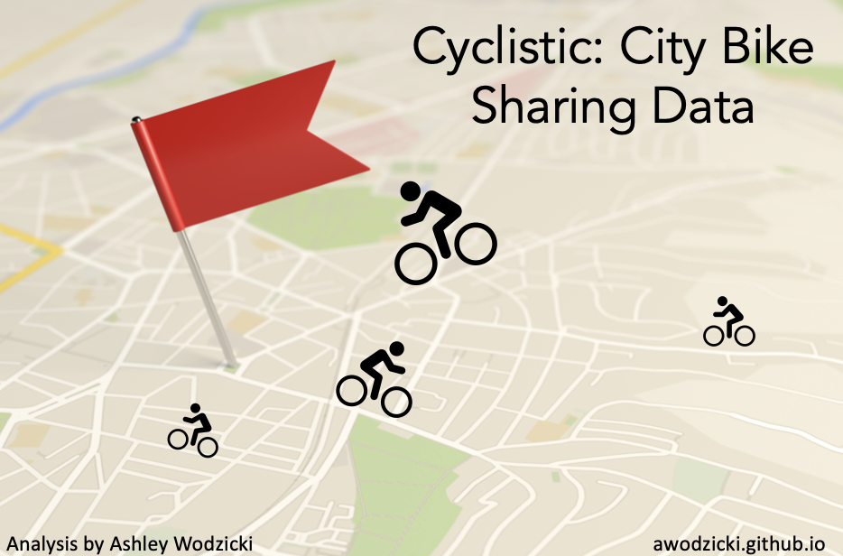

## Data Analysis Portfolio

---
Welcome to my portfolio! This page holds projects I've completed while exploring different tools for data analysis. I hope you enjoy reviewing my projects as much as I enjoyed creating them.

---

[Analyzing Bike Rental Behavior - Case Study](/cyclisticbikeshare.md)
 
This project uses SQL and Tableau to analyzing city bike sharing data to determine differences between casual riders and riders with annual memberships.

---

### Tableau Dashboards

---

---

Page template forked from <a href="https://github.com/evanca/quick-portfolio">evanca</a>

<!-- Remove above link if you don't want to attibute -->
